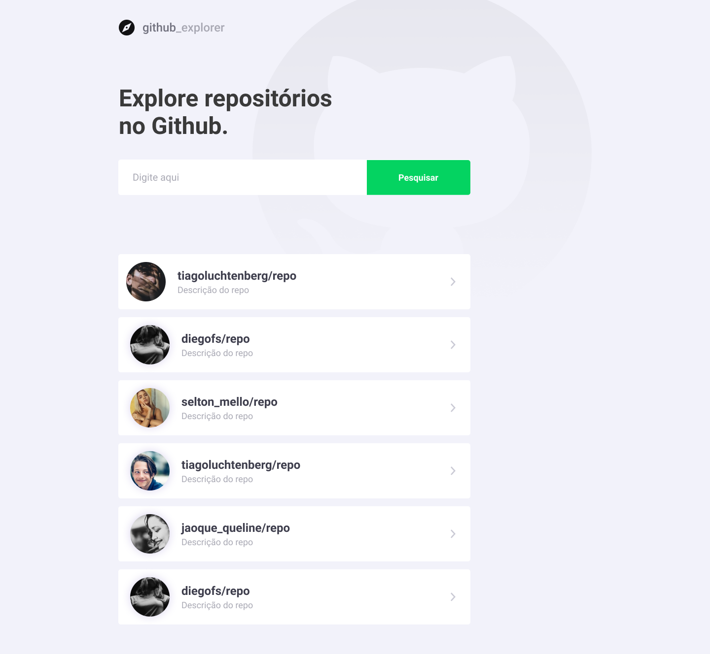

 Hello!

#

## **💻 if you are going to start the project, do the following:**

-  **cd** web
    -  **install the project dependencies:**
        -  **_yarn_**
    -  **start:**
        -  **_yarn_** start
### **🌌 preview**

-  **(1440 x 1328)**
   

### **🔧 technologies used**

-  react js
-  axios
-  api rest
-  typescript
-  eslint
-  prettier
-  git
-  yarn

## **front-end** && **back-end**

